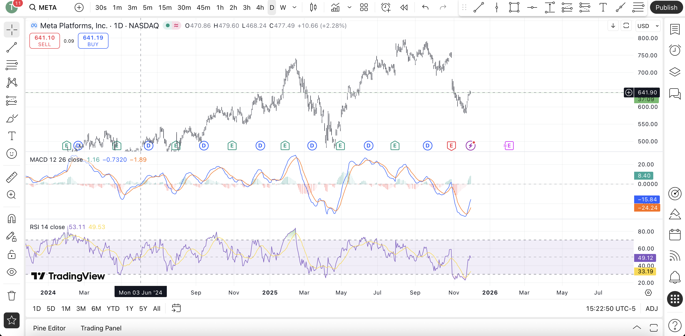
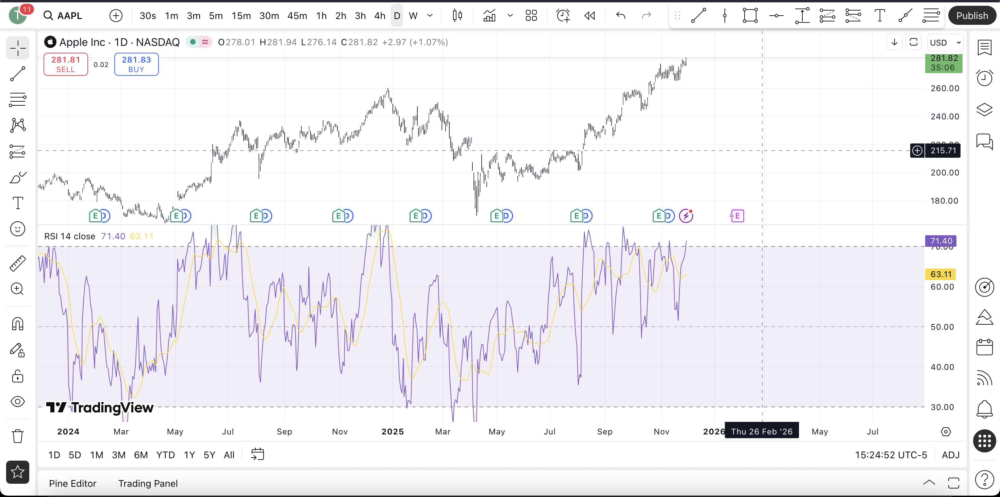

# Technical Analysis Based Algorithmic Trading Strategies: MACD-RSI & Random Forest

## 1. Introduction

This project implements two systematic trading strategies using both technical indicators and machine learning methods. The project is divided into two distinct parts:

1.  **Rule-Based Strategy:** Designing a trading strategy using the **MACD** (Moving Average Convergence Divergence) and **RSI** (Relative Strength Index) indicators.
2.  **Machine Learning Strategy:** Developing a **Random Forest–based classification model** to forecast short-term price trends and construct a trading strategy evaluated through the Sharpe ratio.

---

## 2. Part I: MACD–RSI Rule-Based Trading Strategy

### 2.1 Overview
The first component utilizes the dataset `SP20-2017-2021.csv`. It begins by identifying the stock with the highest volatility. A rule-based trading strategy is then created by combining:

* **MACD:** For detecting the overall trend.
* **RSI:** For determining the timing of entry and exit signals within that trend.

This combination creates a structured system for recognizing trend direction and exploiting short-term reversals.

### 2.2 Technical Background

#### 2.2.1 MACD (Moving Average Convergence Divergence)
The MACD is calculated as follows:

$$\text{MACD Line} = \text{EMA}(12) - \text{EMA}(26)$$
$$\text{Signal Line} = \text{EMA}(9) \text{ of MACD}$$
$$\text{Histogram} = \text{MACD Line} - \text{Signal Line}$$

**Interpretation:**
* **Bullish trend:** MACD line > Signal line
* **Bearish trend:** MACD line < Signal line

MACD provides a trend-following framework for deciding whether the market environment favors long or short positions.

#### 2.2.2 RSI (Relative Strength Index)
RSI measures momentum by comparing average gains and losses over a period (commonly 14 days):

* **RSI < 30:** Indicates oversold conditions.
* **RSI > 70:** Indicates overbought conditions.

RSI is used to filter entries and exits within the MACD-identified trend direction.

### 2.3 Trading Rules
Following the assignment requirements, the strategy logic is as follows:

1.  **Identify Trend Direction:** Use MACD to determine the baseline trend.
    * Consider only **Long** setups during MACD-defined uptrends.
    * Consider only **Short** setups during MACD-defined downtrends.
2.  **Identify Entries using RSI:**
    * **Long Entry:** MACD uptrend AND RSI crossing upward through 30.
    * **Short Entry:** MACD downtrend AND RSI crossing downward through 70.
3.  **Confirm Signals:**
    * Both indicators must agree before placing a trade.
    * Crossovers and threshold breaks are used to validate signal strength.

### 2.4 Implementation Details
The workflow for Part I includes:
1.  Compute MACD and RSI for the selected high-volatility stock.
2.  Generate lists for Buy signals, Sell signals, MACD trend states, and RSI levels.
3.  Construct a position list (`1` = holding, `0` = not holding) using iterative logic.
4.  Merge all computed variables into a final dataframe.
5.  **Visualization:** Plot RSI with buy/sell markers and the Price series with MACD trend coloring to visualize trading logic effectiveness.

---

## 3. Part II: Random Forest Price Direction Forecasting

### 3.1 Overview
The second part uses the dataset `all stocks 10 2015–2020.csv`, containing daily adjusted closing prices for the following tickers:
`GOOGL`, `TSLA`, `META`, `AMZN`, `AAPL`, `MSFT`, `VOD`, `ADBE`, `NVDA`, `CRM`.

A Random Forest classifier is trained to predict next-day price direction and produce trading signals. Performance is evaluated using the out-of-sample Sharpe ratio.

### 3.2 Feature Engineering
Using the `pandas-ta` library, the following seven features are generated for each stock:
* EMA14
* EMA22
* RSI
* PPO (Percentage Price Oscillator)
* MACD
* CMO (Chande Momentum Oscillator)
* RETURN (log price difference)

These features capture trend, momentum, and short-term price variation.

### 3.3 Model Training Procedure
* **Training Set:** Data from **2015–2018**.
* **Testing Set:** Data from **2020**.
* **Label Creation:**
    * Label = $1$ if $p_t > p_{t-1}$
    * Label = $0$ otherwise

A Random Forest classifier is trained on the engineered features to predict next-day trends for all 10 stocks.

### 3.4 Trading Strategy and Sharpe Ratio Evaluation
For each stock, the daily returns of the model's strategy are computed based on the predicted labels. The stock with the highest Sharpe ratio is selected.

**Sharpe Ratio Formula:**

$$\text{Sharpe} = \frac{\text{mean(returns)}}{\text{std(returns)}}$$

### 3.5 Threshold-Based Extension
A modified trading rule is introduced to evaluate momentum requirements:

$$\frac{p_t - p_{t-1}}{p_{t-1}} \geq \delta$$

Where $\delta \in \{0.02, 0.05, 0.10, 0.12, 0.15\}$.
Each threshold is tested on the best-performing stock to evaluate the effect of stronger or weaker momentum filters.

---

## 4. Conclusions

This project demonstrates two systematically different approaches to trading:

1.  A **pure technical-indicator strategy** combining MACD and RSI for rule-based decision-making.
2.  A **machine-learning-driven strategy** using Random Forest classification on engineered features.

Both strategies apply multi-year historical data, incorporate trend and momentum analysis, and generate performance metrics through the Sharpe ratio. The project showcases practical skills in quantitative analysis, technical indicators, machine learning modeling, and systematic trading strategy design.